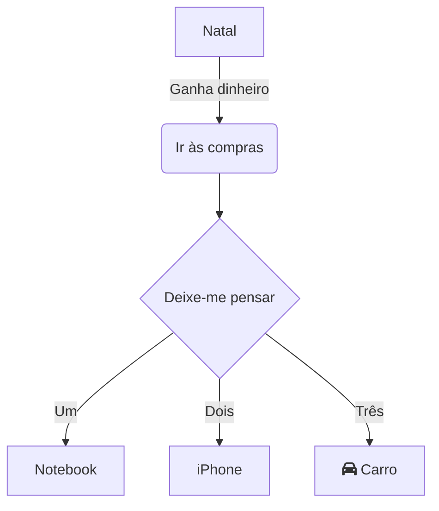
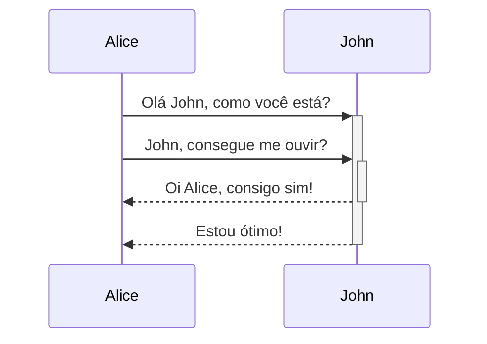
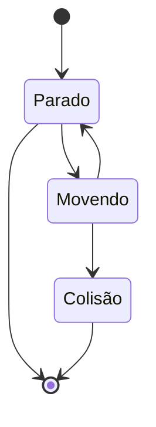

## Fluxograma

```mermaid
flowchart TD
  A[Natal] -->|Ganha dinheiro| B(Ir às compras)
  B --> C{Deixe-me pensar}
  C -->|Um| D[Notebook]
  C -->|Dois| E[iPhone]
  C -->|Três| F[fa:fa-car Carro]
```

## Diagrama de Sequência

```mermaid
sequenceDiagram
    Alice->>+John: Olá John, como você está?
    Alice->>+John: John, consegue me ouvir?
    John-->>-Alice: Oi Alice, consigo sim!
    John-->>-Alice: Estou ótimo!
```

## Diagrama de Estado

```mermaid
stateDiagram-v2
    [*] --> Parado
    Parado --> [*]

    Parado --> Movendo
    Movendo --> Parado
    Movendo --> Colisão
    Colisão --> [*]
```