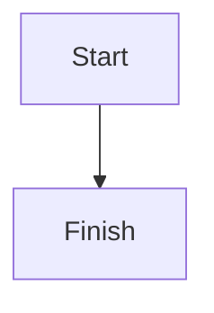

## Overview

Mermaid diagrams are authored with fenced code blocks that use the `mermaid` language identifier.

Docsector turns those definitions into responsive SVG diagrams directly inside the page, so flowcharts, sequence diagrams, and similar visuals can live next to the written explanation.

## Basic Syntax

````markdown

````

## What Docsector Handles

- Lazy-loads Mermaid only when a page actually contains a diagram
- Renders diagrams as responsive SVG output
- Rebuilds the diagram when the reader switches between light and dark mode
- Shows a safe error state if the Mermaid syntax is invalid
- Decodes `&#123;` and `&#125;` before rendering so i18n-safe source still works