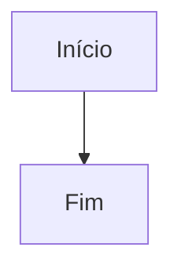

## Visão Geral

Diagramas Mermaid são escritos com fences de código usando o identificador de linguagem `mermaid`.

O Docsector transforma essas definições em SVGs responsivos dentro da própria página, permitindo documentar fluxos, sequências e outros diagramas lado a lado com a explicação em texto.

## Sintaxe Básica

````markdown

````

## O Que o Docsector Faz

- Carrega o Mermaid sob demanda, apenas quando a página realmente contém diagramas
- Renderiza a saída como SVG responsivo
- Reconstrói o diagrama quando o leitor alterna entre modo claro e escuro
- Mostra um estado de erro seguro se a sintaxe Mermaid estiver inválida
- Decodifica `&#123;` e `&#125;` antes da renderização para manter compatibilidade com conteúdo seguro para i18n